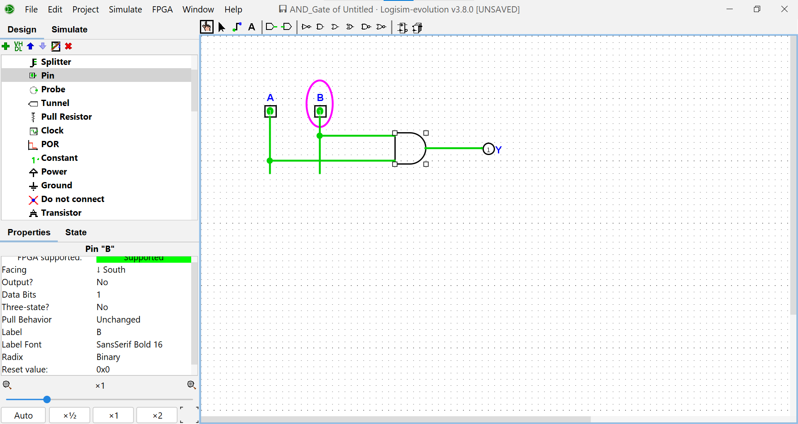
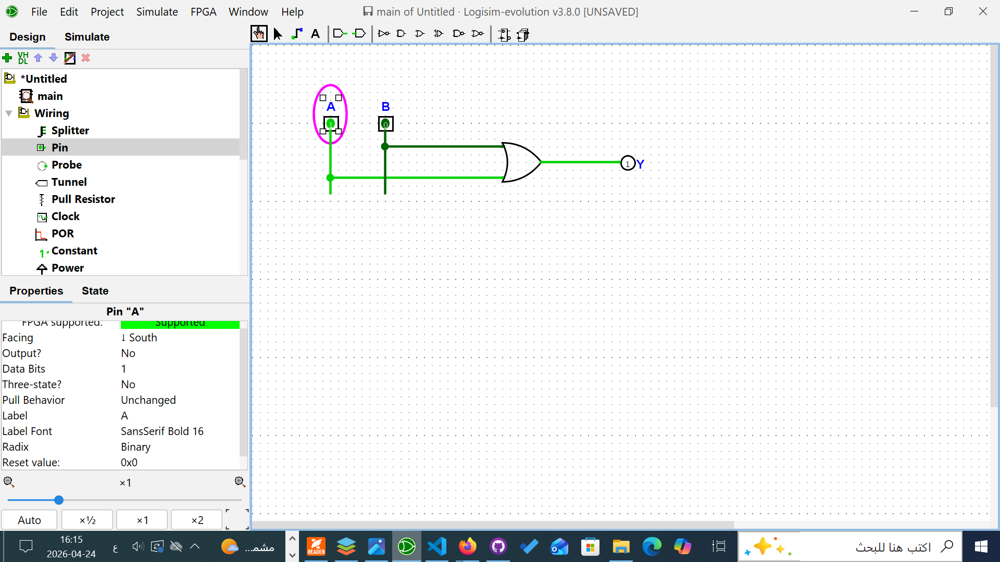
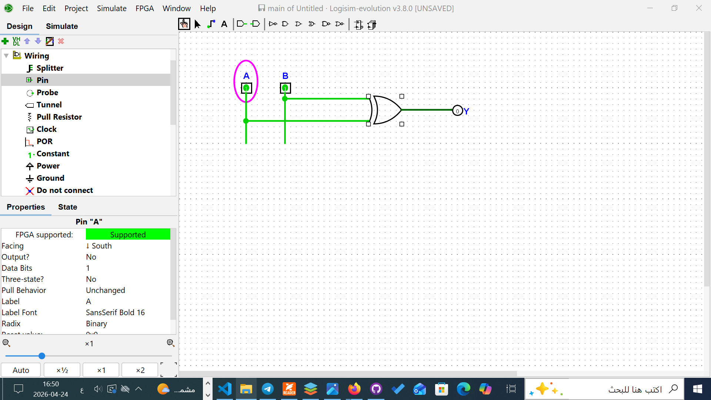

# Lab 01 Report — Logic Gates

> **Instructions:** Fill in every section below. Delete the placeholder text and
> replace it with your own answers. Submit this file as part of your repository.

---

## Student Information

| Field | Value |
|-------|-------|
| **Full Name** | *(enter your full name)* |
| **Student ID** | *(enter your ID number)* |
| **Section / Group** | *(enter your section)* |
| **Submission Date** | *(enter date: YYYY-MM-DD)* |

---

## Part 1 — Truth Tables

Fill in the output column (Y) for each gate based on your simulation results.

### AND Gate — `Y = A · B`

| A | B | Y = A AND B |
|:-:|:-:|:-----------:|
| 0 | 0 | 0 |
| 0 | 1 | 0 |
| 1 | 0 | 0 |
| 1 | 1 | 1 |

### OR Gate — `Y = A + B`

| A | B | Y = A OR B |
|:-:|:-:|:----------:|
| 0 | 0 | 0 |
| 0 | 1 | 1 |
| 1 | 0 | 1 |
| 1 | 1 | 1 |

### XOR Gate — `Y = A ⊕ B`

| A | B | Y = A XOR B |
|:-:|:-:|:-----------:|
| 0 | 0 | 0 |
| 0 | 1 | 1 |
| 1 | 0 | 1 |
| 1 | 1 | 0 |

---

## Part 2 — Questions

**Q1:** What happens to the AND gate output if one input is always 0?
Explain *why* this occurs.

> *(Your answer here — minimum 2 sentences)*

---

**Q2:** How is XOR different from OR? Give a specific numerical example
showing a case where they produce different outputs.

> *(Your answer here — minimum 2 sentences)*

---

**Q3:** Which gate would you use to check if two 1-bit values are equal?
Explain your reasoning.

> *(Your answer here — minimum 2 sentences)*

---

## Part 3 — Summary

Write a paragraph (minimum **50 words**) describing what you learned from
this lab. What was new to you? What was challenging? What surprised you?

> *(Your summary here — at least 50 words)*

---

## Part 4 — Circuit Screenshots

Include screenshots of your completed circuits below.
*(Add more as needed — right-click an image in your file manager and copy the
relative path, e.g. `screenshots/AND_11.png`)*

### AND Gate — Input A=1, B=1 (Y should be 1)

### OR Gate — Input A=1, B=0 (Y should be 1)

### XOR Gate — Input A=1, B=1 (Y should be 0)

---

*Lab 01 | Computer Organization & Digital Design*
